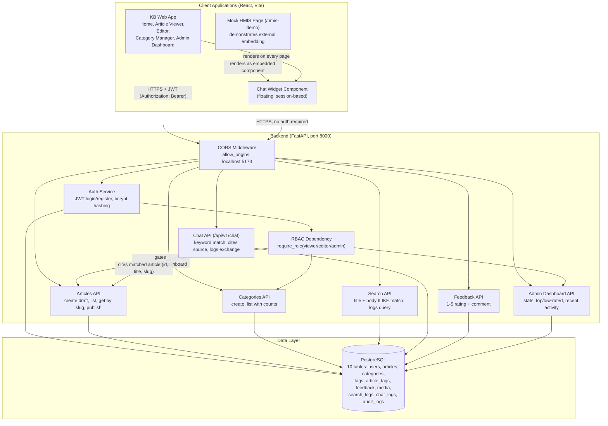

# System Architecture — Healthtech Knowledge Base & HMIS Chatbot Widget

## CORS Flow Notes
- The backend explicitly allows requests from `http://localhost:5173` (the Vite dev server origin) via FastAPI's `CORSMiddleware`.
- The Chat Widget and public read endpoints (articles, search, categories) work without authentication, so they function correctly even when embedded in a third-party origin like the mock HMIS page.
- Write/admin endpoints (create article, publish, create category, admin dashboard) require a valid JWT and the correct role, regardless of which origin the request comes from.

## Auth Flow Notes
- Login (`POST /auth/login`) verifies the password with bcrypt and issues a JWT containing the user's `id` and `role`, valid for 480 minutes (8 hours) by default.
- The frontend stores the token in `localStorage` via `AuthContext`, and an Axios interceptor (`services/api.js`) automatically attaches it to every outgoing request as `Authorization: Bearer <token>`.
- Backend routes use a `require_role(...)` dependency to enforce RBAC: `viewer` can read and submit feedback; `editor`/`admin` can create articles; `admin` alone can publish, create categories, and view the dashboard.
- The frontend additionally guards routes client-side with a `ProtectedRoute` component that redirects unauthenticated or under-privileged users before the page even renders, as a UX layer on top of the backend's own enforcement.

## Chat Widget Flow
1. User opens the chat bubble (available on every KB page and on the mock HMIS page).
2. A random `session_id` is generated per browser session.
3. Each question is sent to `POST /api/v1/chat` with the question text and session ID.
4. The backend searches published article titles first, then falls back to content keyword matching.
5. If a match is found, the response includes the article's `id`, `title`, and `slug`, which the widget renders as a clickable "View source" link.
6. If no match is found, the widget shows a fallback message offering escalation.
7. Every exchange (question, answer, cited article if any) is logged to `chat_logs` for later review.