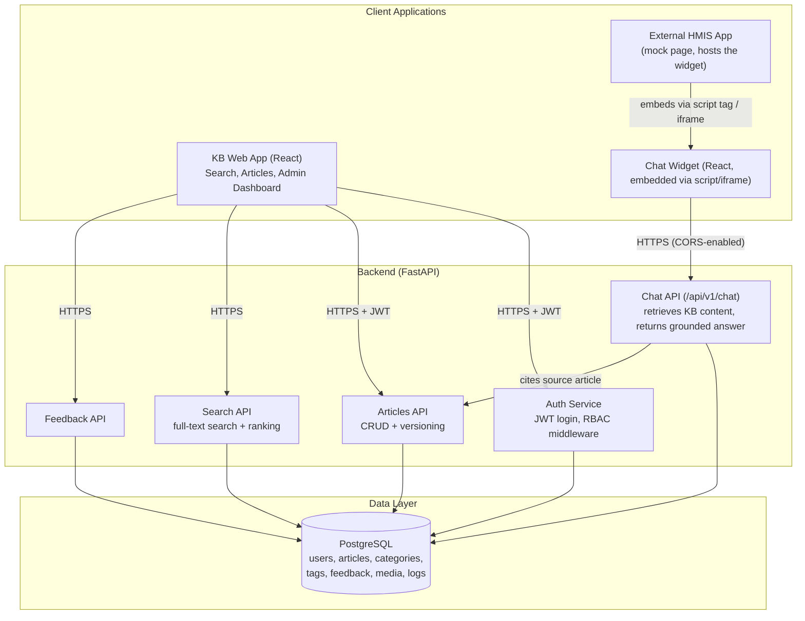

# System Architecture — Healthtech Knowledge Base & HMIS Chatbot Widget

## CORS Flow Notes
- The Widget is loaded inside the HMIS app's origin (a different domain than the KB backend).
- The FastAPI backend must explicitly allow the HMIS app's origin in its CORS configuration (`allow_origins`) so the browser permits the Widget to call `ChatAPI`.
- Only the Chat API and read-only endpoints needed by the widget are exposed to the external origin; admin endpoints remain restricted to the KB App's own origin.

## Auth Flow Notes
- Login issues a JWT (JSON Web Token) containing the user's id and role.
- Every protected request sends this JWT in the `Authorization: Bearer <token>` header.
- RBAC middleware on the backend checks the role in the JWT before allowing access to Editor/Admin routes.
- Sessions expire after 8 hours of inactivity (per PRD FR-3.5).