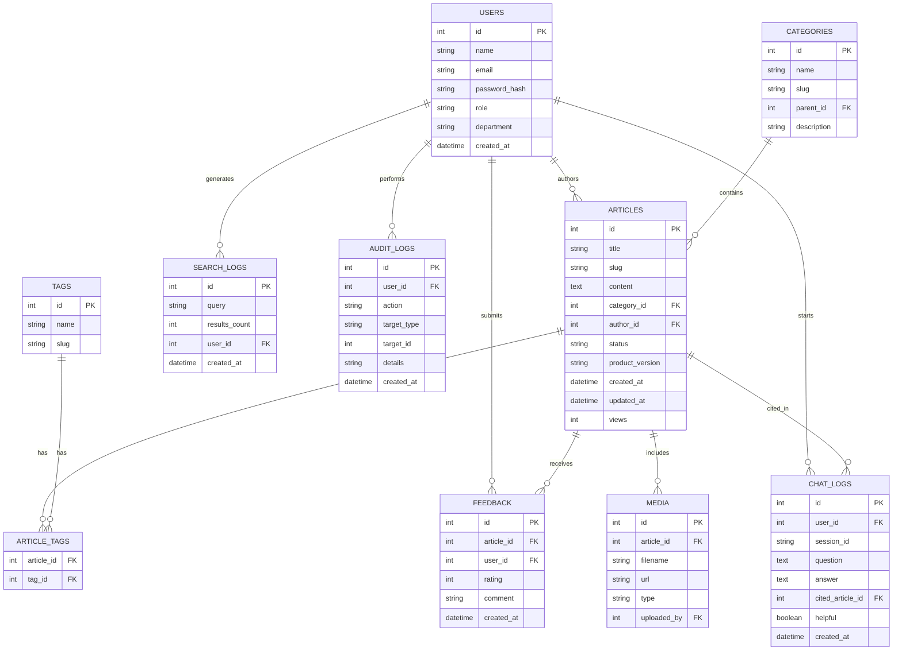

# Entity-Relationship Diagram — Healthtech Knowledge Base

**Note:** `tags`, `article_tags`, and `media` tables exist in the schema but do not yet have corresponding API endpoints or frontend UI. They are reserved for future iterations beyond the current capstone scope.